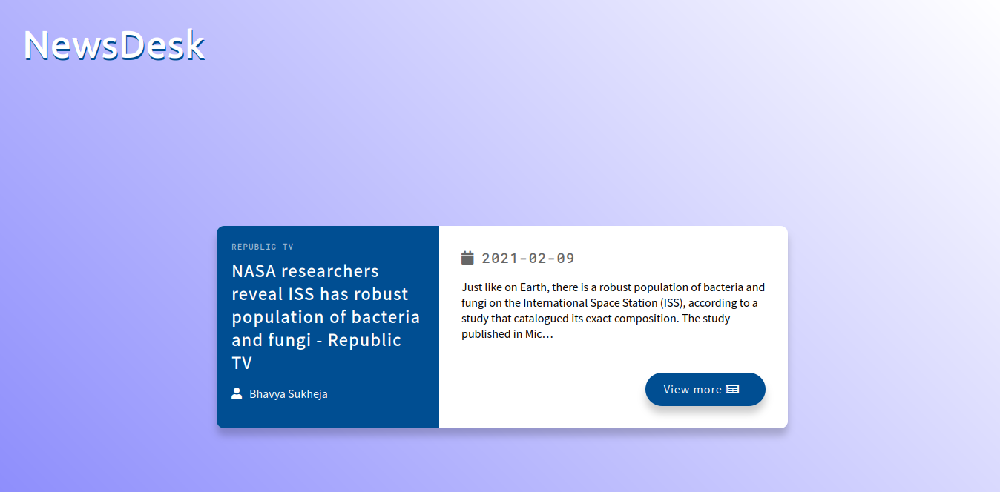

# NEWSDESK

This is a simple web application that fetches news using NEWS api

# IDEA

## TODO
- [ ] Create boilerplates

- [ ] Get fonts and and fontawsome library

- [ ] Link CSS and JS

- [ ] Set background

- [ ] Add heading

- [ ] Colour the heading

- [ ] Add a simple shadow to text

- [ ] Create left side of card

- [ ] Create right side of the card

- [ ] Style the card
